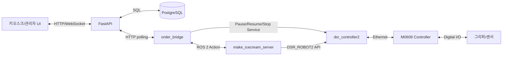
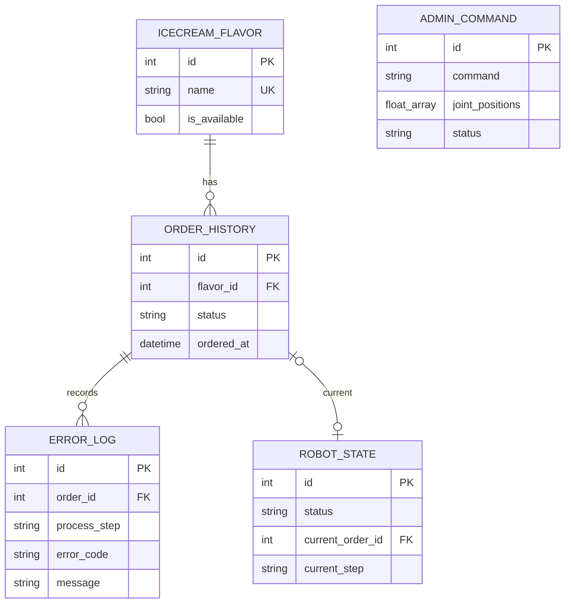

# ROS 2 기반 아이스크림 제조 자동화 시스템 기술문서

## 1. 문서 목적과 기준

이 문서는 Doosan M0609 협동로봇, FastAPI, PostgreSQL, ROS 2를 결합한 아이스크림 자동 제조 시스템의 실제 구현 구조를 설명한다. 대상 독자는 프로젝트를 인수, 검토, 실행하거나 로봇 모션과 웹 서비스를 유지보수하는 개발자 및 운영자다.

작성 기준은 다음과 같다.

- `src`에 제출된 현재 코드를 최우선 근거로 사용한다.
- 좌표와 속도는 장비 배치와 TCP가 동일할 때만 유효하며, 다른 환경에서는 반드시 저속으로 재검증한다.

## 2. 시스템 개요

사용자가 웹 키오스크에서 맛을 선택하면 FastAPI가 주문을 PostgreSQL에 저장한다. `order_bridge`는 가장 오래된 대기 주문을 선점해 `MakeIcecream` Action Goal로 변환한다. `make_icecream_server`는 컵 파지, 스쿱 파지, 힘 기반 진입, 스쿠핑, 컵 투입, 스쿱 반환, 완성 컵 제공과 홈 복귀를 순차 실행한다. 진행 상태와 결과는 FastAPI를 거쳐 UI와 데이터베이스에 반영된다.

본 문서는 현재 코드에 구현된 ROS 2 통합 구조를 확정 사양으로 다룬다.



## 3. 구성 요소와 책임

| 구성 요소 | 위치 | 책임 |
|---|---|---|
| 웹 UI | `frontend/roskin_robbins_v5.html` | 맛 선택, 주문 생성, 진행 표시, 관리자 HMI |
| FastAPI | `backend/app/main.py` | REST/WebSocket, 검증, 상태 전이, DB 접근 |
| PostgreSQL | `backend/schema.sql` | 맛, 주문, 오류, 로봇 상태, 관리자 명령 저장 |
| 주문 브리지 | `icecream_pj/.../integrated_order_bridge.py` | HTTP 주문과 ROS Action 변환, 상태/결과 반영 |
| 제조 서버 | `icecream_pj/.../make_icecream_server.py` | Action 실행, 단계 오케스트레이션, 관리자 Service |
| 공통 제어 | `motion_common.py` | 이동 API 래핑, I/O, 힘 조회, 오류 변환 |
| 모션 모듈 | `cup.py`, `scoop.py`, `serve.py` | 컵, 스쿱, 제조, 서빙 동작 분리 |
| 설정 | `motion_config.py` | TCP, I/O, 좌표, 속도, 힘 임계값 |
| Doosan 드라이버 | 외부 `doosan-robot2` | ROS 2와 실제 컨트롤러 연결 |

FastAPI만 DB에 직접 접근하고 UI와 ROS 노드는 SQL 구조를 알지 못한다. 이 경계는 상태 전이와 데이터 검증을 한곳에서 관리하고 DB 변경의 영향을 줄이기 위한 것이다.

## 4. 실행 구조

### 4.1 Launch 순서

`icecream_system.launch.py`는 다음 순서로 실행한다.

1. `dsr_bringup2_rviz.launch.py`를 포함해 M0609 연결과 RViz를 시작한다.
2. 8초 후 `make_icecream_server`를 시작한다.
3. 10초 후 `order_bridge`를 시작한다.

기본 인자는 `mode=real`, `host=192.168.1.100`, `port=12345`, `model=m0609`, `name=dsr01`, `api_url=http://127.0.0.1:8000`이다.

### 4.2 ROS 2 노드

| 노드 | 역할 | 주요 연결 |
|---|---|---|
| `/dsr01/make_icecream_server` | 제조 Action과 관리자 Service 제공 | `/make_icecream`, `/dsr01/admin_command` |
| `order_bridge` | API polling과 ROS 요청 변환 | Action Client, 관리자/정지 Service Client |
| `dsr_controller2` 계열 | 실제 모션/I/O/정지 처리 | Doosan Controller |

제조 서버는 Action 처리 노드와 동기 DSR API 노드를 분리한다. DSR 동기 API가 executor에서 노드를 분리하는 동작이 Action 수신을 방해하지 않도록 하기 위한 구조다.

## 5. 주문 처리 시퀀스

### 5.1 주문 생성과 선점

1. UI가 판매 가능한 맛을 조회한다.
2. `POST /orders`가 주문을 `PENDING`으로 저장한다.
3. 브리지가 2초 주기로 `/robot/orders/next`를 조회한다.
4. 로봇 상태가 `IDLE` 또는 `READY`이고 활성 주문이 없으면 `/claim`을 호출한다.
5. 조건부 `UPDATE ... WHERE status='PENDING'`에 성공한 주문만 `PROCESSING`이 되어 중복 제조를 방지한다.
6. 브리지가 `order_id`, `flavor_id`, `flavor_name`을 Action Goal로 전송한다.

### 5.2 제조 단계

| 순서 | Feedback 단계 | 담당 모듈 | 완료 기준 |
|---:|---|---|---|
| 1 | `CUP_PICK` | `CupMotion.pick()` | 컵 파지와 180° 뒤집기 |
| 2 | `CUP_PLACE` | `CupMotion.place()` | 작업대에 컵 배치 |
| 3 | `SCOOP_PICK` | `ScoopMotion.pick()` | 스쿱 파지 |
| 4 | `MOVE_TO_ICECREAM` | `move_to_icecream()` | 선택 레인의 진입 접근점 도달 |
| 5 | `SCOOP_ICECREAM` | `scoop()` | 힘 기반 진입과 M2~M6 스쿠핑 |
| 6 | `PUT_ICECREAM_IN_CUP` | `put_in_cup()` | J6 회전으로 컵에 배출 |
| 7 | `SCOOP_RETURN` | `return_scoop()` | 거치대에 스쿱 반환 |
| 8 | `SERVE_CUP` | `ServeMotion.serve()` | 고객 제공 위치에 컵 배치 |
| 9 | `ORDER_COMPLETED` | Action Server | 제품 제공 완료 통지 |
| 10 | `RETURN_HOME` | `return_home()` | 홈 복귀와 J6 오차 보정 |
| 11 | `ROBOT_IDLE` | Action Server | 다음 주문 수신 가능 |

제품 제공 완료와 로봇 준비 완료는 분리한다. `order_completed=true`는 컵 제공 여부를, `robot_ready=true`는 홈 복귀까지 성공해 다음 주문을 받을 수 있는지를 나타낸다.

### 5.3 진행 상태 전달

Action Feedback의 `current_step`을 브리지가 진행률과 사용자 메시지로 변환한다. 브리지는 `/robot/orders/{id}/feedback`에 상태를 전송하고 FastAPI는 해당 주문의 WebSocket `/ws/orders/{id}`로 브로드캐스트한다.

주문 상태는 `PENDING`, `PROCESSING`, `COMPLETED`, `FAILED`이고 로봇 상태는 `IDLE`, `READY`, `PROCESSING`, `RETURNING_HOME`, `ERROR`, `STOPPED`이다.

## 6. ROS 2 인터페이스

### 6.1 MakeIcecream Action

Action 이름은 `/make_icecream`이다.

| 구분 | 필드 | 의미 |
|---|---|---|
| Goal | `order_id` | DB 주문 식별자 |
| Goal | `flavor_id` | 맛 식별자와 향후 맛별 동작 확장 정보 |
| Goal | `flavor_name` | 로그와 운영 확인용 맛 이름 |
| Result | `success` | 전체 Action 성공 여부 |
| Result | `order_completed` | 고객 제공까지 완료했는지 여부 |
| Result | `robot_ready` | 홈 복귀 후 다음 주문을 받을 수 있는지 여부 |
| Result | `process_step` | 실패 단계 |
| Result | `error_code` | 표준 오류 코드 |
| Result | `message` | 상세 결과 메시지 |
| Feedback | `current_step` | 현재 제조 단계 |

### 6.2 AdminCommand Service

Service 이름은 `/dsr01/admin_command`이다.

| 구분 | 필드 | 의미 |
|---|---|---|
| Request | `command` | 수동 동작 명령 |
| Request | `joint_positions` | `MOVE_JOINTS`용 6축 관절값 |
| Response | `success` | 실행 성공 여부 |
| Response | `message` | 결과 또는 실패 사유 |

지원 명령은 `HOME`, `END`, `CUP_PICK`, `CUP_PLACE`, `SCOOP_PICK`, `ICECREAM`, `SERVE_CUP`, `GRIPPER_OPEN`, `GRIPPER_CUP`, `GRIPPER_SCOOP`, `MOVE_JOINTS`다. `START`, `PAUSE`, 제조 중 `END`는 브리지에서 로봇 상태와 Doosan의 Pause/Resume/Stop Service를 조합해 처리한다.

## 7. FastAPI 인터페이스

### 7.1 UI와 상태

| Method | Path | 역할 |
|---|---|---|
| GET | `/`, `/kiosk` | 통합 키오스크/관리자 HTML 제공 |
| GET | `/admin`, `/database` | 관리자 화면으로 이동 |
| GET | `/health` | API와 DB 연결 상태 확인 |
| WS | `/ws/orders/{order_id}` | 주문 진행 상태 실시간 전달 |
| GET/PATCH | `/robot/state` | 단일 로봇 최신 상태 조회/갱신 |

### 7.2 맛과 주문

| Method | Path | 역할 |
|---|---|---|
| GET | `/flavors` | 맛 목록 조회 |
| PUT | `/flavors/selection` | 서로 다른 판매 맛 3개 선택 |
| PATCH | `/flavors/{id}` | 맛 정보와 판매 상태 수정 |
| POST | `/orders` | 판매 가능한 맛으로 주문 생성 |
| GET | `/orders`, `/orders/{id}` | 주문 이력 조회 |
| GET | `/orders/stats` | 상태/맛별 주문 통계 |
| GET | `/robot/orders/next` | 가장 오래된 대기 주문 조회 |
| POST | `/robot/orders/{id}/claim` | 주문 원자적 선점 |
| POST | `/robot/orders/{id}/feedback` | 로봇 진행/완료/실패 반영 |

### 7.3 오류와 관리자 명령

| Method | Path | 역할 |
|---|---|---|
| POST/GET | `/errors` | 오류 저장/조회 |
| GET | `/errors/stats` | 단계/코드별 오류 통계 |
| POST | `/robot/admin/commands` | 관리자 명령 생성 |
| GET | `/robot/admin/commands/next` | 대기 명령 조회 |
| POST | `/robot/admin/commands/{id}/claim` | 명령 선점 |
| PATCH | `/robot/admin/commands/{id}/result` | 성공/실패 결과 저장 |

API 요청의 DB 트랜잭션은 요청 단위 dependency에서 commit 또는 rollback된다. 브리지의 HTTP timeout은 3초이며 주문 polling 기본 주기는 2초, 관리자 명령 polling 주기는 0.5초다.

## 8. 데이터베이스 설계



`robot_state`는 `id=1`만 허용하는 단일 행 테이블이다. `admin_command`는 동시에 하나의 `PENDING` 또는 `PROCESSING` 명령만 허용하도록 API에서 검사한다. 현재 구현은 주문 처리 외에 관리자 명령 테이블도 함께 관리한다.

## 9. 로봇 제어 설계

### 9.1 좌표와 I/O

- 기준 좌표계: `DR_BASE`
- TCP: `GripperDA_v1_A3`
- 로봇 모델: M0609
- 컵/스쿱 solution: `SOL_CUP=2`, `SOL_SCOOP=2`
- DO1/DI1: 스쿱 파지/확인
- DO2: 그리퍼 열기
- DO3/DI3: 컵 파지/확인

출력은 파지 명령 전에 모두 끄고 필요한 출력 하나만 활성화해 상호 충돌을 막는다. 좌표는 `motion_config.py`에서 6개 값 `[X,Y,Z,Rx,Ry,Rz]` 또는 관절값으로 관리한다.

### 9.2 역기구학과 이동

`movejx_cup()`과 `movejx_scoop()`은 고정 solution 2를 사용한다. `select_nearest_solution()`은 0~7 후보에 대해 역기구학과 순기구학을 수행하고 위치 오차 2mm 이내인 후보 중 현재 관절 자세와 가장 가까운 해를 선택할 수 있다.

모션 반환값이 `None` 또는 `0`이 아니면 실패로 간주한다. `movej`, `movel`, `movejx` 공통 래퍼가 예외를 상위 제조 단계로 전달한다.

### 9.3 힘 기반 진입 감지

고정 깊이만 사용하면 재료 표면이 낮아질 때 접촉을 놓치거나 바닥을 누를 수 있다. 현재 알고리즘은 접촉 전 힘을 기준값으로 잡고 1mm씩 하강하면서 X/Z 힘 변화량을 계산한다.

```text
delta = sqrt((Fx - baseline_Fx)^2 + (Fz - baseline_Fz)^2)
```

| 파라미터 | 값 | 역할 |
|---|---:|---|
| `ENTRY_Z_STEP` | 1.0mm | 하강 간격 |
| `ENTRY_Z_SETTLE_WAIT` | 0.4s | 각 측정 전 안정화 |
| `F_ENTRY_DELTA` | 1.3N | 접촉 후보 임계값 |
| `ENTRY_CONSEC_HIT_NEEDED` | 2회 | 노이즈 오검출 방지 |
| `F_ENTRY_HARD_LIMIT_DELTA` | 15N | 진입 탐색 즉시 중단 기준 |
| `F_EMERGENCY_LIMIT` | 40N | M2~M6 각 축 절댓값 중단 기준 |

자세에 따라 무접촉 Fz가 편향될 수 있으므로 절댓값 대신 baseline 대비 변화량을 사용한다. 능동 목표힘과 순응제어는 예상보다 깊게 파고드는 거동 때문에 제외하고 위치제어 기반 델타 감지를 채택했다.

### 9.4 레인 순회

두 레인의 Y 오프셋은 `[-25.0, 30.0]`이다. 서버는 메모리에서 레인을 1→2→1 순으로 왕복한다. `PUT_ICECREAM_IN_CUP`까지 성공한 후에만 상태를 확정하므로 실패 시 다음 주문이 같은 레인을 다시 시도한다. 서버 재시작 시 상태는 초기화되어 레인 1부터 시작한다.

### 9.5 컵 투입과 복귀

M6와 컵 투입 자세의 큰 차이를 한 번의 직선 보간으로 처리하지 않고 첫 구간에 `movejx`를 사용한다. 레인 2는 통 벽과 컵에 가까워 Y축을 먼저 맞춘다. 배출은 J6을 -120° 회전하고 2초 기다린 뒤 Z축으로 50mm 이탈하고 J6을 복귀한다. 스쿱 반환 전에는 종이컵 적재 위치를 피하도록 100mm 상승한다.

## 10. 오류 처리와 안전

### 10.1 오류 전파

하위 모션 예외는 `run_step()`에서 `MotionError`로 변환된다. 스쿠핑 단계 오류는 `SCOOP_FAILED`, 그 외 일반 이동 오류는 `MOVE_FAILED`, 예측하지 못한 오류는 `UNKNOWN_ERROR`로 결과에 기록된다. 브리지는 제품 제공 전 실패에 대해 `/errors`에 단계, 코드, 메시지를 저장하고 로봇 상태를 `ERROR`로 바꾼다.

### 10.2 취소와 관리자 제어

- Action Cancel 요청은 `soft_stop()`을 호출한다.
- 제조 중 `END`는 Doosan `MoveStop(stop_mode=2)` 후 Action 취소를 요청한다.
- 제조 중 일반 수동 명령은 거부한다.
- `PAUSE`와 `START`는 각각 MovePause와 MoveResume Service를 사용한다.
- 서버의 `busy_lock`은 제조 Action과 수동 Service의 동시 실행을 차단한다.

### 10.3 실행 전 안전 확인

- 작업 셀 안에 사람이 없는지 확인한다.
- 컵, 스쿱, 통, 작업대, 서빙 위치의 고정을 확인한다.
- `DR_BASE`, TCP, I/O 배선을 확인한다.
- 최초 경로는 속도 오버라이드 10~20%에서 확인한다.
- E-Stop과 Soft Stop 위치 및 동작을 확인한다.
- 오류 후 현재 파지물과 로봇 위치를 확인하기 전 자동 재시작하지 않는다.

세부 위험요소는 작업자 충돌, 협착, 통 전도, 스쿱 이탈, 컵 변형/기울어짐, 재료 비산, 내용물 낙하, 특이점, 통신 장애다.

## 11. 현재 제한사항과 개선 과제

1. **파지 실패 처리**: DI1/DI3 확인이 실패해도 현재 `grip_with_retry()`는 경고만 남기고 계속 진행한다. 이름과 달리 실제 재시도나 중단이 없으므로 실기 안전 검증 후 정책을 강화해야 한다.
2. **관리자 인증**: 관리자 PIN은 프론트엔드 편의 기능이며 서버 측 인증/권한 검사가 아니다. 운영 배포에는 인증과 접근 제어가 필요하다.
3. **레인 상태 영속성**: 레인 순회 상태가 메모리에만 있어 서버 재시작 시 초기화된다.
4. **Heartbeat 부재**: HTTP timeout은 있지만 명시적 로봇 heartbeat와 통신 단절 상태 전이는 구현되어 있지 않다.
5. **프로세스 복구**: 브리지나 API가 중단되면 `PROCESSING` 주문/명령이 남을 수 있으므로 시작 시 stale 상태 복구 정책이 필요하다.
6. **실기 검증 범위**: 현재 제출 코드의 속도/좌표/힘 임계값은 장비와 재료 조건에 따라 달라질 수 있다. 따라서 속도/좌표/레인 2를 포함한 반복 실기 시험 기록을 별도로 관리해야 한다.
7. **패키지 의존성**: `integrated_order_bridge.py`가 `dsr_msgs2`를 직접 import하므로 `icecream_pj/package.xml`에 직접 실행 의존성을 선언하는 것이 바람직하다.
8. **배포 보안**: DB 접속 문자열, 관리자 PIN, API의 네트워크 노출 범위를 환경별로 분리해야 한다.

## 12. 검증 전략

### 12.1 소프트웨어

- Python 구문 검사와 ROS 인터페이스 빌드
- FastAPI `/health`와 API 입력 검증 시험
- 주문 선점의 중복 방지 시험
- Action Goal 수락/거부/취소 시험
- 관리자 명령의 단일 처리 및 결과 저장 시험
- WebSocket 주문 피드백 시험

### 12.2 가상 컨트롤러

- `movej`, `movel`, `movejx`, I/O API 호출 성공 여부
- 0~7 solution 후보와 도달 가능성
- 제조 단계 순서와 오류 전파
- 연속 주문에서 레인 순회 상태

### 12.3 실제 로봇

- 모든 접근점/작업점/이탈점을 10~20% 속도로 개별 확인
- 컵/스쿱 DI와 실제 파지 상태 비교
- 진입 baseline, delta, 검출 Z, 최대 힘 기록
- 레인별 통 벽/컵/거치대 간섭 확인
- 배출 성공률과 내용물 낙하/비산 확인
- Action Cancel, Pause, Resume, END와 E-Stop 시험
- 제품 제공 후 홈 복귀와 J6 오차 확인


## 13. 유지보수 규칙

- DB 컬럼을 바꾸면 `schema.sql`, migrations, Pydantic 모델, API 쿼리를 함께 수정한다.
- Action/Service 필드를 바꾸면 `icecream_interfaces`와 모든 Client/Server를 다시 빌드한다.
- 제조 단계명을 바꾸면 Action Feedback, `STEP_INFO`, DB CHECK 제약, 오류 모델을 함께 수정한다.
- 좌표/속도/힘 임계값을 바꾸면 변경 이유, 장비 배치, 시험 속도, 결과를 기록한다.
- I/O 번호와 TCP를 바꾸면 코드뿐 아니라 컨트롤러 및 WebLogic 설정을 함께 확인한다.
- UI 폴더나 파일명을 바꾸면 FastAPI의 `KIOSK_HTML` 경로도 수정한다.

---

문서 기준일: 2026-08-29
